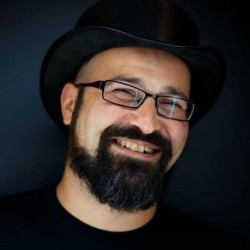

# Baruch Sadogursky

    

Baruch Sadogursky (a.k.a JBaruch) is the Head of Developer Relations and a Developer Advocate at JFrog. His passion is speaking about technology. Well, speaking in general, but doing it about technology makes him look smart, and 17 years of hi-tech experience sure helps. When he’s not on stage (or on a plane to get there), he learns about technology, people and how they work, or more precisely, don’t work together.

He is a CNCF ambassador, Developer Champion, and a professional conference speaker on DevOps, DevSecOps and Development topics, and is a regular at the industry’s most prestigious events including DockerCon, Devoxx, DevOps Days, OSCON, Qcon, JavaOne and many others. You can see some of his talks at [https://jfrog.com/shownotes](https://jfrog.com/shownotes).