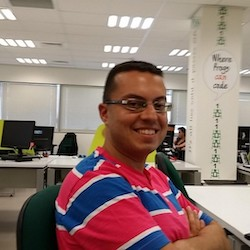

# Eyal Ben Moshe

  

Eyal has been leading the Eco-System team at JFrog for the past 4 years. They have been developing and maintaining innovative open source projects, all under the domain of CI/CD and DevOps automation solutions: the Jenkins Artifactory Plugin and JFrog CLI.