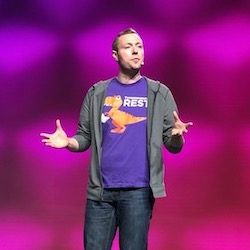

# Leon Stigter

   ) 

Leon is a Developer Advocate at JFrog where his focus is on helping developers get the most out of their DevOps tools with the end goal of enabling those developers to achieve the Liquid Software vision. As an outspoken supporter of developers Leon advocates for the needs of developers within JFrog and helps to drive open source tooling and Developer Relations strategy.

Leon is passionate about serverless and container technologies and enjoys writing code and speaking and blogging about that. In his personal life, he’s on a mission to taste cheesecake in every city he visits (suggestions are welcome [@LeonStigter](https://twitter.com/leonstigter)).